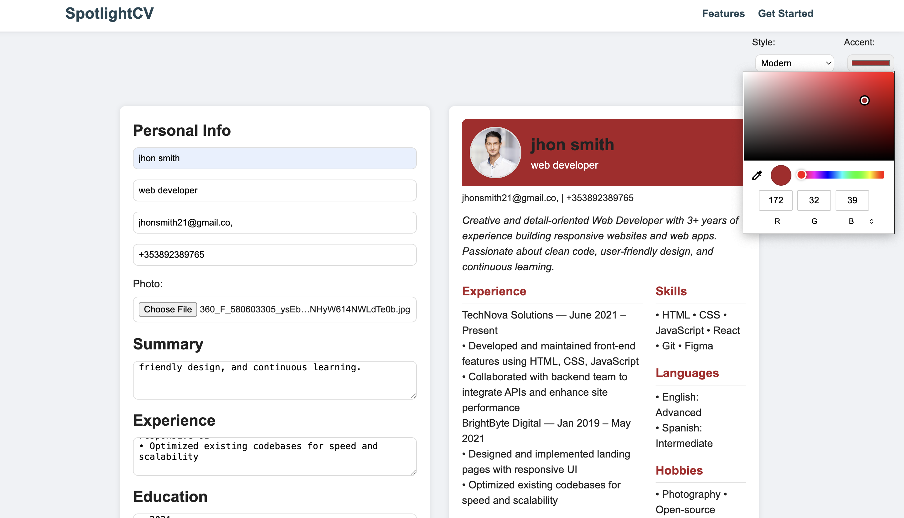

# SpotlightCV

_Your career, center stage._

A professional CV/resume generator built with plain JavaScript, HTML, and CSS.

## Features

- Multi‑section form: Personal Info, Summary, Experience, Education, Achievements, Skills, Languages, Hobbies  
- Live two‑column preview  
- Theme selection: Classic & Modern  
- Accent color picker  
- Profile picture upload  
- Export to styled PDF (html2pdf.js)  

## Usage

1. Clone this repo  
2. Open `index.html` in your browser  
3. Fill out your details, choose a style & accent color  
4. Click “Download PDF” to save your resume  

## Technologies

- HTML5, CSS3, JavaScript (ES6)  
- [html2pdf.js](https://github.com/eKoopmans/html2pdf.js) for PDF export  

## 🖼️ Project Screenshot

